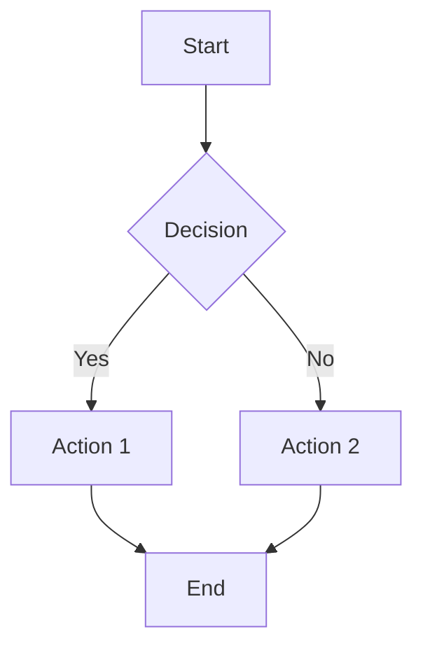
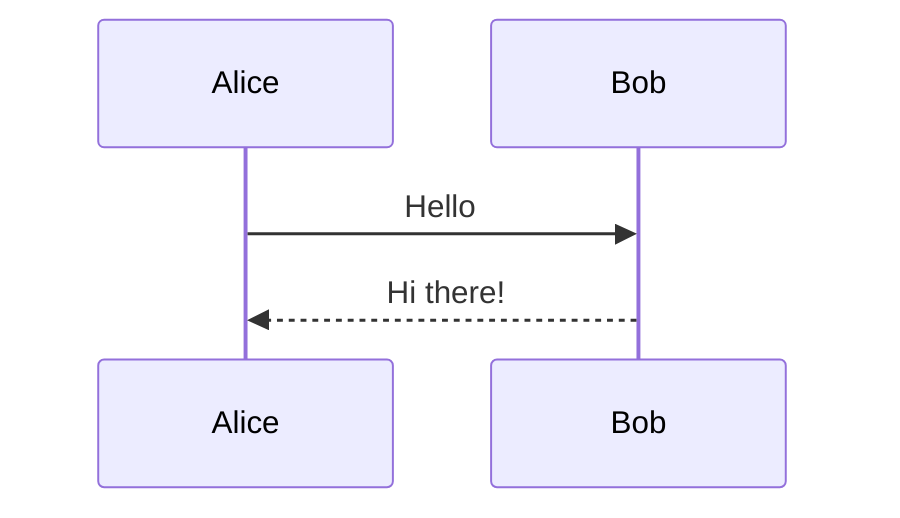
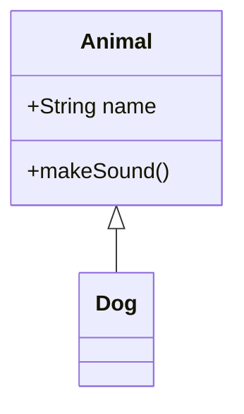
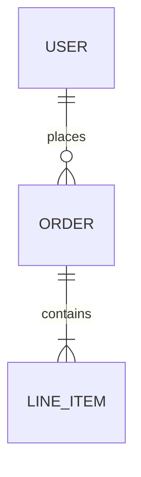
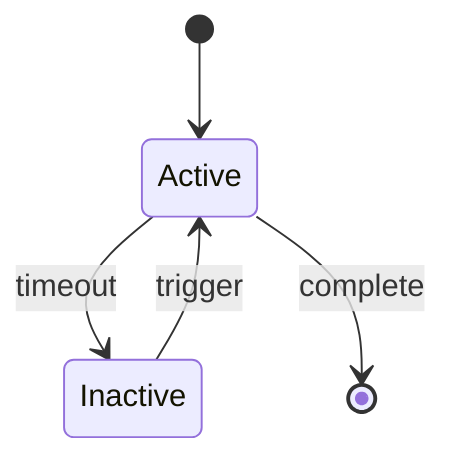
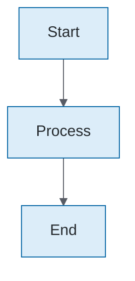

# Mermaid Diagram Generation

This skill provides comprehensive guidance for creating Mermaid diagrams with official Trimble branding.

## Supported Diagram Types

| Type | Syntax Keyword | Use Case |
|------|----------------|----------|
| Flowchart | `flowchart` | Process flows, decision trees, algorithms |
| Sequence | `sequenceDiagram` | API interactions, message flows, protocols |
| Class | `classDiagram` | Class hierarchies, interfaces, OOP structure |
| ER | `erDiagram` | Database schemas, entity relationships |
| State | `stateDiagram-v2` | State machines, workflows, lifecycles |
| Gantt | `gantt` | Project timelines, schedules |
| Pie | `pie` | Distribution, proportions |
| Git Graph | `gitGraph` | Branch strategies, commit history |
| Mindmap | `mindmap` | Idea organization, hierarchical concepts |
| Timeline | `timeline` | Historical events, chronological data |

## Quick Syntax Reference

### Flowchart


**Key elements:**
- Direction: `TD` (top-down), `LR` (left-right), `BT`, `RL`
- Nodes: `[rect]`, `(rounded)`, `{diamond}`, `[[subroutine]]`, `[(cylinder)]`, `((circle))`
- Links: `-->`, `---`, `-.->`, `==>`, `--text-->`
- Subgraphs: `subgraph title ... end`

### Sequence Diagram


**Key elements:**
- Participants: `participant`, `actor`
- Messages: `->>`, `-->>`, `-)`, `-x`
- Activation: `activate`/`deactivate` or `+`/`-`
- Blocks: `loop`, `alt`/`else`, `opt`, `par`/`and`, `critical`

### Class Diagram


**Key elements:**
- Visibility: `+` public, `-` private, `#` protected, `~` package
- Relationships: `<|--` inheritance, `*--` composition, `o--` aggregation

### ER Diagram


**Key elements:**
- Cardinality: `||` one, `o|` zero or one, `|{` one or more, `o{` zero or more
- Attributes: `type name PK/FK/UK "comment"`

### State Diagram


**Key elements:**
- States: `[*]` start/end, `state "name" as alias`
- Transitions: `-->`, `--> : label`
- Composite: `state Parent { ... }`

## Trimble Theme Integration

### For Markdown Files (Inline Themes)

When diagrams will be rendered in markdown (GitHub, GitLab, VS Code, PR descriptions), use inline theme directives to embed Trimble branding directly in the diagram:



The `%%{init:...}%%` directive embeds theme variables so the diagram is self-contained and styled consistently regardless of where it's rendered.

**See `references/inline-themes.md` for copy-paste theme directives for each diagram type.**

### For PNG/SVG Export (Theme Files)

When rendering to image files, use the JSON theme files with `mmdc`:

| Diagram Type | Theme File |
|--------------|------------|
| Flowchart | `tools/docs/mermaid/themes/trimble-flowchart.json` |
| Sequence | `tools/docs/mermaid/themes/trimble-sequence.json` |
| Class | `tools/docs/mermaid/themes/trimble-class.json` |
| ER | `tools/docs/mermaid/themes/trimble-er.json` |
| State | `tools/docs/mermaid/themes/trimble-state.json` |
| Gantt | `tools/docs/mermaid/themes/trimble-gantt.json` |
| Pie | `tools/docs/mermaid/themes/trimble-pie.json` |
| Git Graph | `tools/docs/mermaid/themes/trimble-gitgraph.json` |
| Mindmap | `tools/docs/mermaid/themes/trimble-mindmap.json` |
| Timeline | `tools/docs/mermaid/themes/trimble-timeline.json` |

Requires mermaid-cli: `npm install -g @mermaid-js/mermaid-cli`

```bash
# Render with Trimble theme
mmdc -i diagram.mmd -o diagram.png -c tools/docs/mermaid/themes/trimble-flowchart.json
```

### When to Use Which

| Destination | Method |
|-------------|--------|
| README, docs, PR descriptions | Inline theme directive |
| Presentations, exports, sharing | PNG/SVG with theme file |
| Quick prototyping | No theme (default) |

## Best Practices

1. **Keep diagrams simple**: Break complex diagrams into smaller components
2. **Use meaningful names**: Node IDs should be descriptive
3. **Add labels**: Relationship labels improve clarity
4. **Consistent direction**: Pick one direction and stick with it
5. **Group related items**: Use subgraphs/namespaces
6. **Avoid crossing lines**: Rearrange nodes to minimize crossings

## Choosing the Right Diagram Type

| Scenario | Recommended Diagram |
|----------|---------------------|
| Process flow, algorithm | Flowchart |
| API calls, service interactions | Sequence |
| Object-oriented design, interfaces | Class |
| Database schema, data models | ER |
| State machine, workflow states | State |
| Project schedule | Gantt |
| Distribution breakdown | Pie |
| Branch strategy, commits | Git Graph |
| Brainstorming, hierarchy | Mindmap |
| Historical events | Timeline |

## Available Commands

For specific diagram types, use the dedicated slash commands:
- `/mermaid-flowchart` - Flowcharts and process diagrams
- `/mermaid-sequence` - Sequence and interaction diagrams
- `/mermaid-class` - Class and object diagrams
- `/mermaid-er` - Entity-relationship diagrams
- `/mermaid-state` - State machine diagrams
- `/mermaid-git` - Git branch diagrams
- `/mermaid-architecture` - System architecture diagrams
- `/mermaid-from-code` - Auto-detect from code analysis

## Additional Resources

### Reference Files

For detailed syntax and examples, consult:
- **`references/syntax-reference.md`** - Complete syntax for all diagram types with examples
- **`references/trimble-brand-colors.md`** - Official Trimble 2025 brand color palette
- **`references/inline-themes.md`** - Copy-paste theme directives for markdown diagrams

### Example Files

Working diagram examples in `examples/`:
- **`flowchart.mmd`** - All node shapes and link styles
- **`sequence.mmd`** - Actors, alt blocks, notes, autonumber
- **`class.mmd`** - Classes, interfaces, relationships
- **`er.mmd`** - Entities, attributes, cardinality
- **`state.mmd`** - States, transitions, composite states
- **`gantt.mmd`** - Tasks, milestones, dependencies
- **`pie.mmd`** - Pie chart with segments
- **`gitgraph.mmd`** - Branches, commits, merges
- **`mindmap.mmd`** - Hierarchical concept map
- **`timeline.mmd`** - Chronological events

### Related Skills

- **`mermaid-render`** - Detailed rendering options and theme customization
