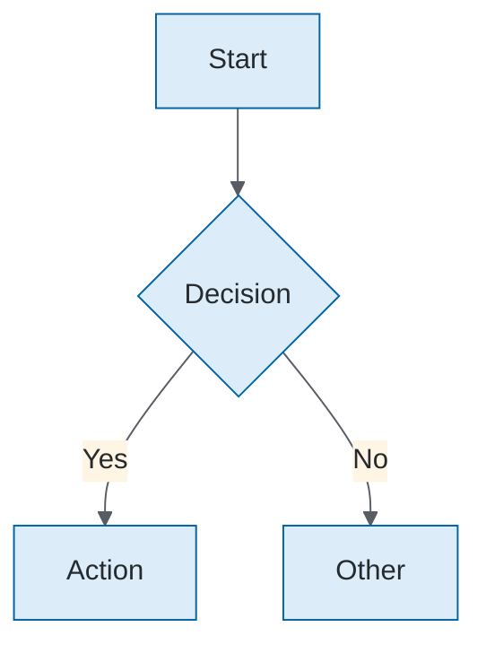
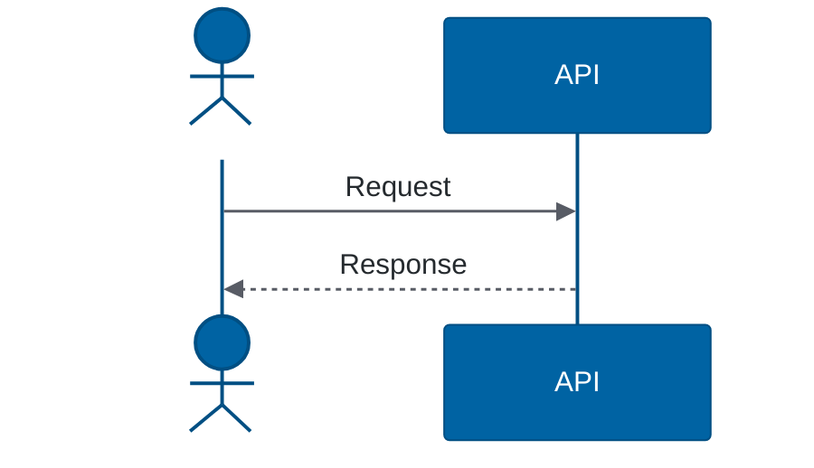
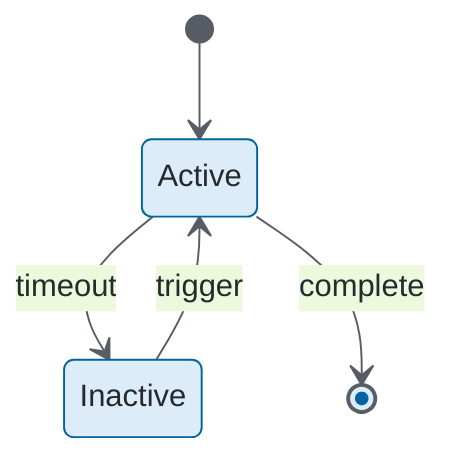
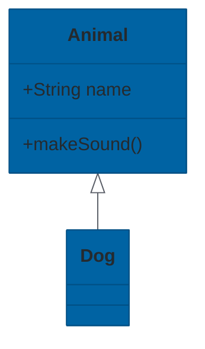
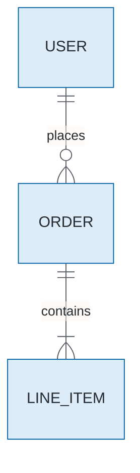
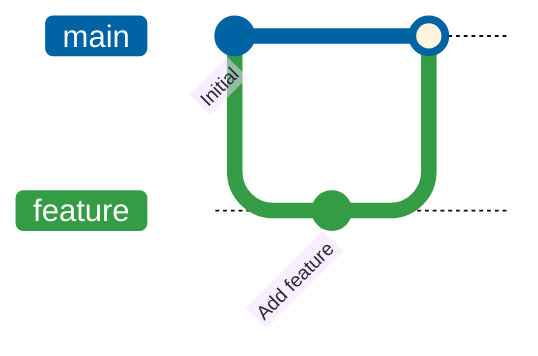

# Inline Theme Directives

Copy-paste these directives at the top of Mermaid diagrams to apply Trimble branding when rendered in markdown files (GitHub, GitLab, VS Code, etc.).

## When to Use

Use inline themes when:
- Diagram will be viewed in markdown (README, docs, PR descriptions)
- Diagram needs consistent branding without external theme files
- Sharing diagrams in platforms that render Mermaid natively

For PNG/SVG export, use `mmdc` with theme JSON files instead (see `mermaid-render` skill).

---

## Flowchart

```
%%{init: {'theme': 'base', 'themeVariables': {'primaryColor': '#DCEDF9', 'primaryTextColor': '#252A2E', 'primaryBorderColor': '#0063A3', 'secondaryColor': '#FFF5E4', 'secondaryBorderColor': '#FBAD26', 'tertiaryColor': '#E0ECCF', 'tertiaryBorderColor': '#349C44', 'lineColor': '#585C65', 'textColor': '#252A2E'}}}%%
flowchart TD
    A[Start] --> B[Process]
```

**Usage:**


---

## Sequence Diagram

```
%%{init: {'theme': 'base', 'themeVariables': {'actorBkg': '#0063A3', 'actorTextColor': '#FFFFFF', 'actorBorder': '#004F83', 'signalColor': '#585C65', 'signalTextColor': '#252A2E', 'activationBkgColor': '#DCEDF9', 'activationBorderColor': '#0063A3', 'noteBkgColor': '#FFF5E4', 'noteBorderColor': '#FBAD26', 'labelBoxBkgColor': '#E0ECCF', 'labelBoxBorderColor': '#349C44'}}}%%
sequenceDiagram
    participant A as Alice
    participant B as Bob
```

**Usage:**


---

## State Diagram

```
%%{init: {'theme': 'base', 'themeVariables': {'primaryColor': '#DCEDF9', 'primaryTextColor': '#252A2E', 'primaryBorderColor': '#0063A3', 'lineColor': '#585C65', 'textColor': '#252A2E'}}}%%
stateDiagram-v2
    [*] --> State1
```

**Usage:**


---

## Class Diagram

```
%%{init: {'theme': 'base', 'themeVariables': {'primaryColor': '#0063A3', 'primaryTextColor': '#FFFFFF', 'primaryBorderColor': '#004F83', 'secondaryColor': '#DCEDF9', 'secondaryTextColor': '#252A2E', 'secondaryBorderColor': '#0063A3', 'lineColor': '#585C65', 'textColor': '#252A2E'}}}%%
classDiagram
    class Example
```

**Usage:**


---

## ER Diagram

```
%%{init: {'theme': 'base', 'themeVariables': {'primaryColor': '#DCEDF9', 'primaryTextColor': '#252A2E', 'primaryBorderColor': '#0063A3', 'secondaryColor': '#E0ECCF', 'secondaryBorderColor': '#349C44', 'lineColor': '#585C65', 'textColor': '#252A2E'}}}%%
erDiagram
    ENTITY1 ||--o{ ENTITY2 : relationship
```

**Usage:**


---

## Git Graph

```
%%{init: {'theme': 'base', 'themeVariables': {'git0': '#0063A3', 'git1': '#349C44', 'git2': '#FBAD26', 'git3': '#B44E2A', 'gitBranchLabel0': '#FFFFFF', 'gitBranchLabel1': '#FFFFFF', 'gitBranchLabel2': '#252A2E', 'gitBranchLabel3': '#FFFFFF', 'commitLabelColor': '#252A2E', 'tagLabelColor': '#FFFFFF', 'tagLabelBackground': '#0063A3'}}}%%
gitGraph
    commit
```

**Usage:**


---

## Trimble Brand Colors Reference

| Purpose | Color | Hex |
|---------|-------|-----|
| Primary (Blue) | Trimble Blue 10 | `#0063A3` |
| Primary Light | Blue tint | `#DCEDF9` |
| Secondary (Green) | Trimble Green 10 | `#349C44` |
| Secondary Light | Green tint | `#E0ECCF` |
| Accent (Gold) | Trimble Gold 10 | `#FBAD26` |
| Accent Light | Gold tint | `#FFF5E4` |
| Error (Brown) | Trimble Brown 10 | `#B44E2A` |
| Text | Hero Gray | `#252A2E` |
| Lines | Steel Gray | `#585C65` |
| Background | White | `#FFFFFF` |
| Surface | Light Gray | `#F1F1F6` |
