# Mermaid Syntax Reference

Complete syntax documentation for all Mermaid diagram types.

## 1. Flowchart

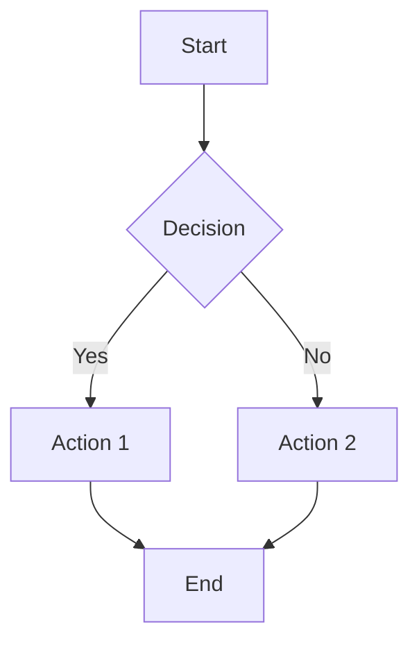

### Direction

| Code | Direction |
|------|-----------|
| `TD` / `TB` | Top to bottom |
| `BT` | Bottom to top |
| `LR` | Left to right |
| `RL` | Right to left |

### Node Shapes

| Syntax | Shape | Use Case |
|--------|-------|----------|
| `[text]` | Rectangle | Processes, actions |
| `(text)` | Rounded rectangle | Start/end |
| `{text}` | Diamond | Decisions |
| `[[text]]` | Subroutine | Subprocess |
| `[(text)]` | Cylinder | Database/storage |
| `((text))` | Circle | Connectors |
| `>text]` | Flag | Asymmetric |
| `{{text}}` | Hexagon | Preparation |

### Link Types

| Syntax | Style |
|--------|-------|
| `-->` | Arrow |
| `---` | Line (no arrow) |
| `-.->` | Dotted arrow |
| `==>` | Thick arrow |
| `--text-->` | Arrow with label |
| `--text---` | Line with label |

### Subgraphs

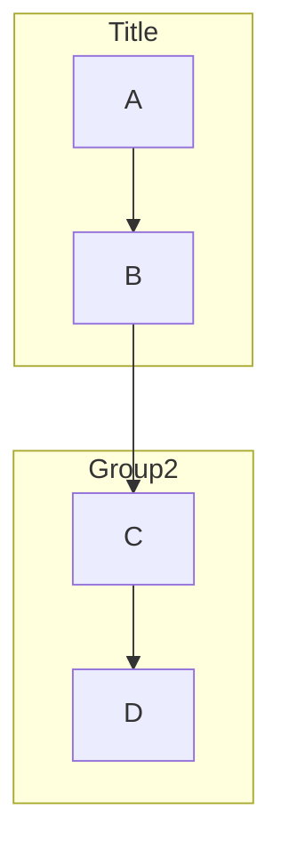

---

## 2. Sequence Diagram

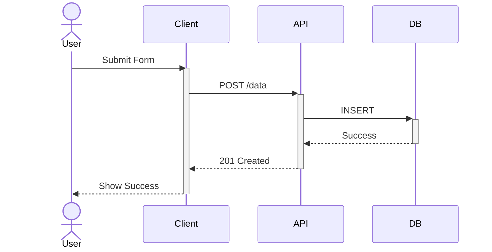

### Participants

```
participant A as Alice
actor U as User
```

### Message Types

| Syntax | Description |
|--------|-------------|
| `->>` | Solid line, arrowhead |
| `-->>` | Dotted line, arrowhead |
| `-)` | Async message |
| `-x` | Lost message (X) |
| `--x` | Dotted lost message |

### Activation

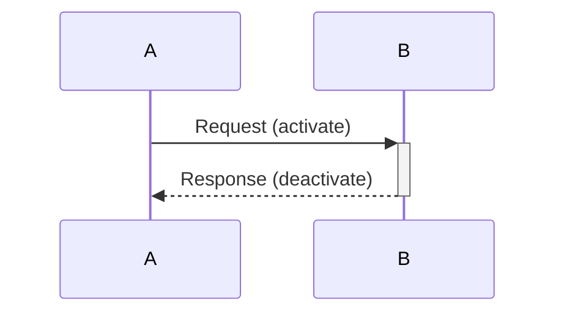

Or explicit:
```
activate A
deactivate A
```

### Control Flow

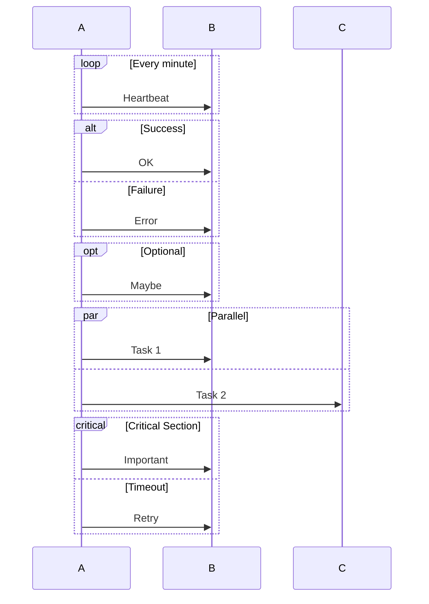

### Notes

```
Note right of A: Single participant
Note over A,B: Spanning note
Note left of A: Left side
```

---

## 3. Class Diagram

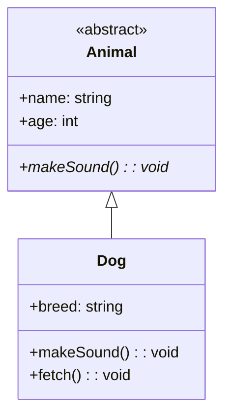

### Visibility

| Symbol | Visibility |
|--------|------------|
| `+` | Public |
| `-` | Private |
| `#` | Protected |
| `~` | Package/Internal |

### Relationships

| Syntax | Relationship |
|--------|--------------|
| `<\|--` | Inheritance |
| `*--` | Composition |
| `o--` | Aggregation |
| `-->` | Association |
| `..>` | Dependency |
| `..\|>` | Implementation |

### Cardinality

```
A "1" --> "*" B : has many
A "1" --> "0..1" B : has optional
```

### Annotations

```
<<interface>>
<<abstract>>
<<enumeration>>
<<service>>
```

### Namespaces

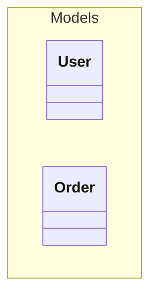

---

## 4. ER Diagram

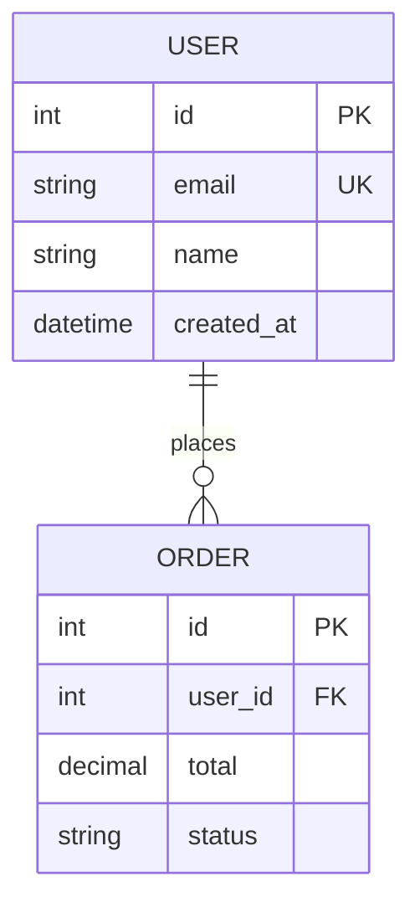

### Cardinality Notation

| Left | Right | Meaning |
|------|-------|---------|
| `\|o` | `o\|` | Zero or one |
| `\|\|` | `\|\|` | Exactly one |
| `o{` | `}o` | Zero or more |
| `\|{` | `}\|` | One or more |

### Common Patterns

```
||--|| One to one
||--o{ One to many
o{--o{ Many to many
||--o| One to zero or one
```

### Attributes

```
type name PK "comment"
type name FK
type name UK
```

---

## 5. State Diagram

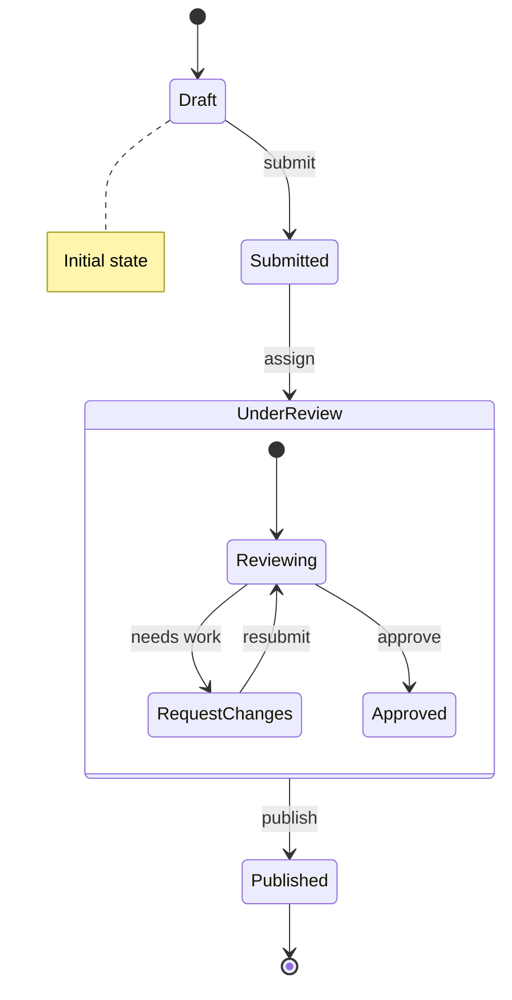

### Special States

```
[*]  Start/end state
state "Long Name" as alias
```

### Composite States

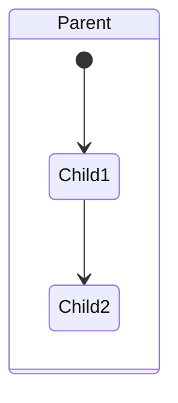

### Choice/Fork/Join

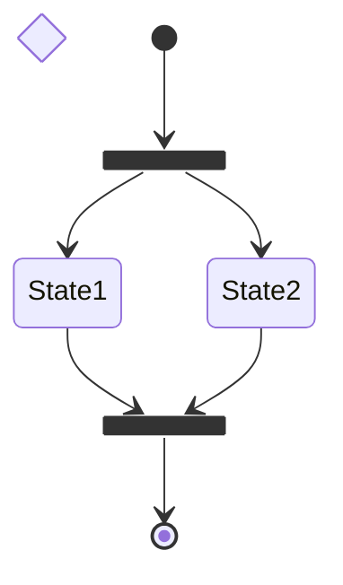

### Concurrency

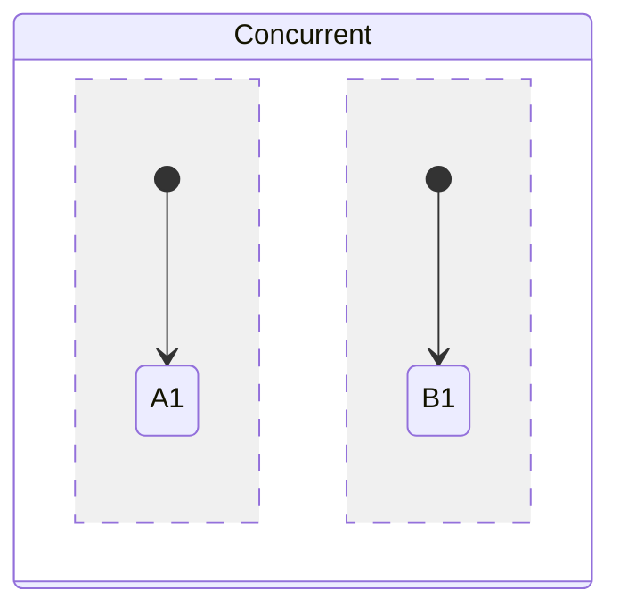

---

## 6. Gantt Chart

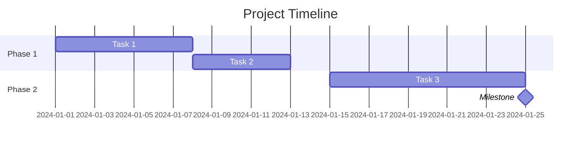

### Task Syntax

```
taskName: [id], [start], [duration]
taskName: [id], after [dependency], [duration]
taskName: crit, [id], [start], [duration]  (critical)
taskName: done, [id], [start], [duration]  (completed)
taskName: active, [id], [start], [duration]  (in progress)
```

---

## 7. Pie Chart

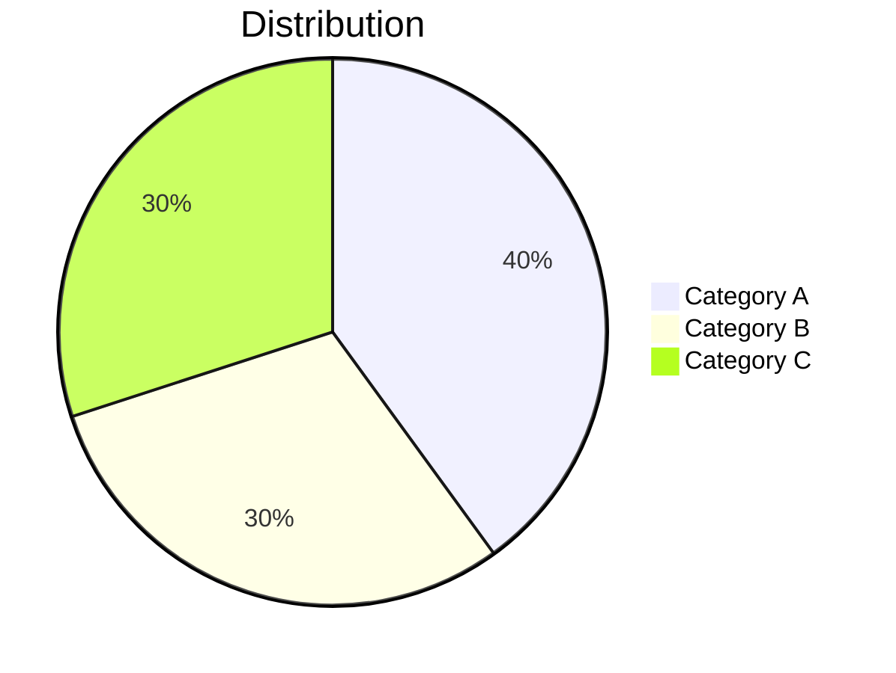

Options:
```
pie showData
    "A": 50
    "B": 50
```

---

## 8. Git Graph

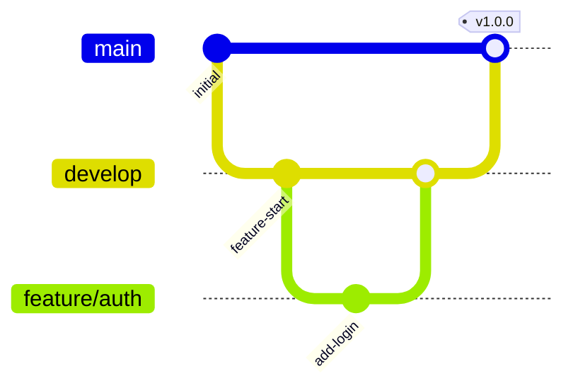

### Commands

| Command | Description |
|---------|-------------|
| `commit` | Add commit |
| `commit id: "msg"` | Commit with ID |
| `commit tag: "v1.0"` | Commit with tag |
| `commit type: HIGHLIGHT` | Highlighted commit |
| `branch name` | Create branch |
| `checkout name` | Switch branch |
| `merge name` | Merge branch |
| `cherry-pick id: "abc"` | Cherry-pick commit |

### Commit Types

```
NORMAL (default)
REVERSE (revert)
HIGHLIGHT (important)
```

---

## 9. Mindmap

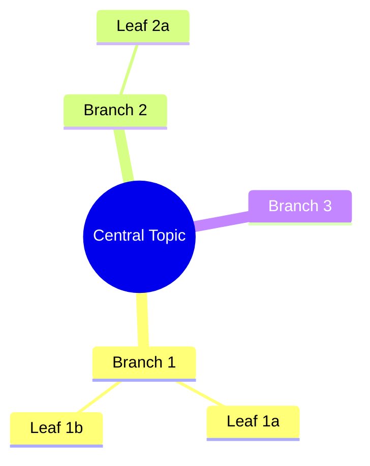

### Node Shapes

```
root((Circle))
    [Square]
    (Rounded)
    ))Bang((
    {{Cloud}}
```

---

## 10. Timeline

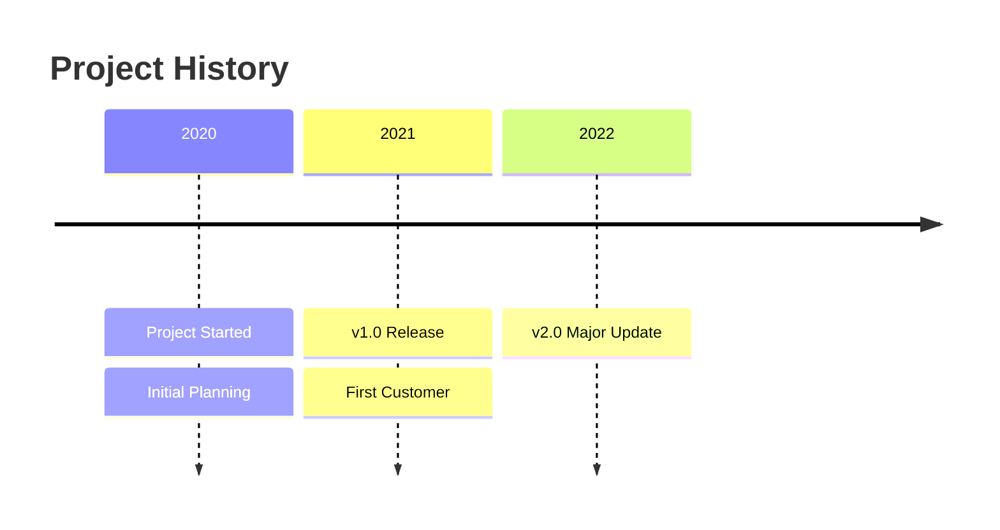

---

## Common Styling

### Inline Styles

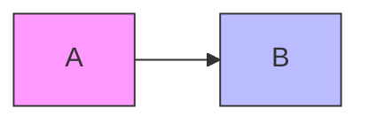

### Class Definitions

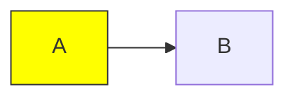

### Link Styles

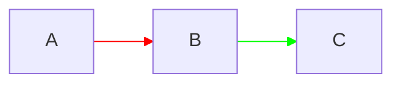
